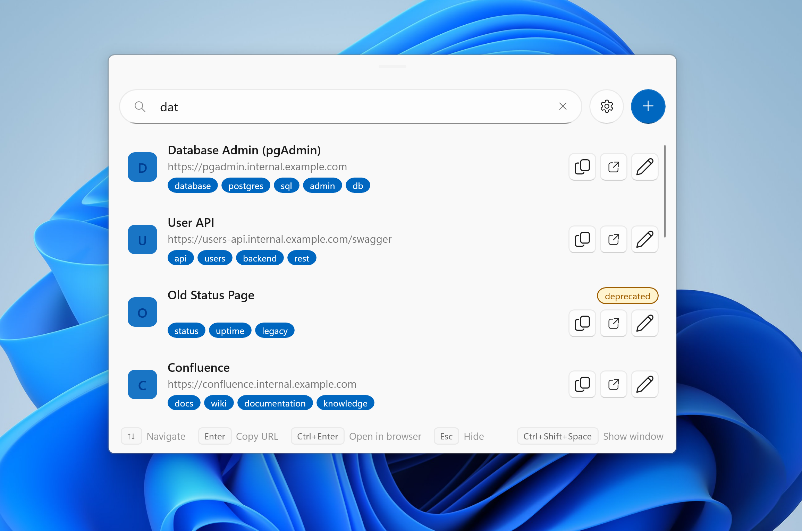

# QuickLink

A lightweight Windows 11 URL launcher that lives in your system tray. Press a global hotkey, search for a resource by name or tag, and copy its URL to the clipboard in one keystroke — no browser required.



## Features

- **Instant search** — fuzzy-match resources by name, tag, or URL as you type
- **One-key copy** — press `Enter` to copy the current URL to the clipboard
- **Open in browser** — press `Ctrl+Enter` to launch the URL directly
- **Tags & deprecation** — organise resources with tags and mark stale entries as deprecated
- **Global hotkey** — summon the window from anywhere with a configurable shortcut (default `Ctrl+Shift+Space`)
- **System tray** — hides instead of closing; accessible from the tray at all times
- **Acrylic backdrop** — native Windows 11 Mica/Acrylic look, no title bar chrome

## Keyboard shortcuts

| Key | Action |
|-----|--------|
| `↑` / `↓` | Navigate results |
| `Enter` | Copy URL to clipboard |
| `Ctrl+Enter` | Open URL in browser |
| `Esc` | Hide window |
| `Ctrl+Shift+Space` | Show window (global, from tray) |

## Requirements

- Windows 10 (1809+) or Windows 11
- [.NET 10 Runtime](https://dotnet.microsoft.com/download/dotnet/10.0)
- [Windows App SDK 2.1](https://learn.microsoft.com/windows/apps/windows-app-sdk/downloads)

## Installation

Run the install script **as Administrator** from the repository root. It builds the project, self-signs the MSIX, and installs it.

```powershell
.\install.ps1
```

Optional flags:

```powershell
.\install.ps1 -Platform ARM64          # x64 (default), x86, ARM64
.\install.ps1 -Configuration Debug     # Release (default) or Debug
```

After installation, **QuickLink** appears in Start and Windows Search.

## Building from source

```powershell
dotnet build src\QuickLink.csproj -c Release -p:Platform=x64
```

## Data

Resources are stored in `sample-data\resources.json` next to the executable. Each entry has a name, description, tags, one or more URLs, and an optional "current" URL pointer.
